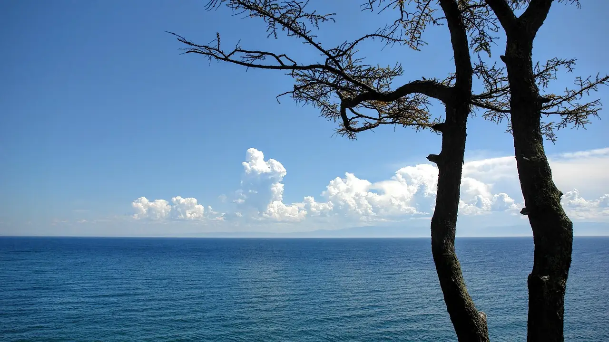
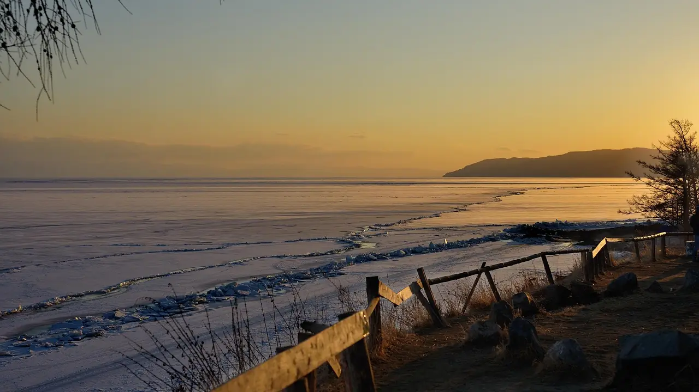

# Озеро Байкал: где находится — глубина, координаты и ключевые факты

Озеро Байкал находится в Южной Сибири, Россия. Координаты: 51°–55° с.ш., 103°–110° в.д. Граница двух регионов — Иркутской области и Республики Бурятия. Ближайший крупный город — Иркутск, около 70 км от западного берега.

## Где находится Байкал — географическое положение и координаты

Байкал — Южная Сибирь. Точнее — Восточная Сибирь, если хочется педантизма. Координаты: 51°–55° с.ш., 103°–110° в.д. Зажат между горными хребтами — Байкальским, Баргузинским, Хамар-Дабаном. Не просто лежит в ямке, а сидит в тектонической котловине, которую земля разрывала миллионами лет.

Административно делится между двумя регионами. Западный берег — Иркутская область. Восточный — Республика Бурятия. Два хозяина, одно озеро.

Расстояния. До Москвы — около 5 200 км. Это не близко, да. До Иркутска — порядка 70 км. До Улан-Удэ — около 130 км. Вот ваши ориентиры на карте России.

Где байкал на карте найти? Ищите правее Иркутска. Большое синее пятно, вытянутое с юго-запада на северо-восток. Не заметить невозможно — даже на мелком масштабе.

### Административная принадлежность

Байкал — не чей-то единоличный. Озеро байкал где находится административно — на границе двух субъектов РФ, и точка. Западный берег — Иркутская область. Восточный — Республика Бурятия. Граница проходит прямо по воде.

Никакого единого хозяина. Два региона, два бюджета, две бюрократии. Отсюда, кстати, половина экологических проблем — когда непонятно, кто отвечает, не отвечает никто.

Байкал где находится географически — в Восточной Сибири. Административно — между Иркутском и Улан-Удэ. Буквально.

### Ближайшие города и населённые пункты

Вопрос «байкал в каком городе» — сам по себе показательный. Озеро не «в городе». Оно между ними. И это важно понимать до того, как покупать билеты.

| Населённый пункт | Расстояние до берега |
|---|---|
| Листвянка | на берегу |
| Слюдянка | на берегу |
| Северобайкальск | на берегу |
| Иркутск | ~70 км |
| Улан-Удэ | ~130 км |

Теперь по делу. Если спрашивают, байкал какой город ближе всего — ответ: Иркутск. Семьдесят километров, час езды, нормальный аэропорт. Это главные ворота с западной стороны. Улан-Удэ закрывает восточный берег — дальше, но тоже рабочий вариант.

Листвянка, Слюдянка, Северобайкальск — это уже не «рядом с Байкалом». Это прямо на нём. Приехал — и вот он, берег.

## Основные характеристики озера Байкал

*[Источник](https://pixabay.com/photos/baikal-lake-russia-irkutsk-outlook-1681161/) — Peggy_Marco on Pixabay*

Цифры — вот где заканчиваются споры. Байкал глубина максимальная — **1 642 метра**. Это не просто рекорд. Это пропасть. Самое глубокое озеро на планете, и точка.

Средняя глубина — около **744 м**. Площадь озера Байкал — **31 722 км²**, примерно как Бельгия. Длина — **636 км**, ширина — до **79 км**. Вытянутое, узкое, похожее на гигантский разлом. Собственно, оно и есть разлом — тектонический.

Сколько лет озеру Байкал? От **25 до 30 миллионов**. Большинство озёр живут тысячи лет и исчезают. Байкал пережил несколько эпох и никуда не торопится.

Запасы пресной воды — **23 615 км³**. Около **20% всех поверхностных запасов пресной воды** Земли. В одном озере. Дно озера Байкал лежит на **1 186 метров ниже уровня моря** — ниже, чем дно Каспия.

Это не озеро. Это факт природы, который неудобно игнорировать.

### Рекорды и уникальность Байкала

Что такое Байкал? Это не просто озеро. Это планетарная аномалия. Описание озера Байкал в двух словах: самое глубокое, самое старое, самое ёмкое. Цифры говорят лучше любых эпитетов.

| Характеристика | Значение |
|---|---|
| Максимальная глубина | 1 642 м — рекорд для всех озёр Земли |
| Запасы пресной воды | ~20% мировых — больше, чем во всех Великих озёрах США вместе взятых |
| Возраст | ~25–30 млн лет — древнейшее озеро на планете |
| Число эндемичных видов | ~3 700, включая байкальскую нерпу — единственный пресноводный тюлень в мире |
| Крупнейший остров | Ольхон |
| Единственная вытекающая река | Ангара |

Впадает в Байкал больше трёхсот рек. Вытекает одна. Ангара. Вот так и работает эта система — всё берёт, отдаёт по минимуму. Узнаёте кого-нибудь?

Объект ЮНЕСКО с 1996 года. Не за красоту — за уникальность. Разница принципиальная.

## Статус и охрана

1996 год. ЮНЕСКО включает Байкал в список Всемирного наследия. Не за красивые глаза — за уникальность, которой нет нигде на планете. Это объект ЮНЕСКО, и статус реальный, а не декоративный: он создаёт международные обязательства и хоть какой-то барьер против самых диких хозяйственных авантюр.

Байкальский государственный природный биосферный заповедник охраняет южную часть побережья. Буферная зона. Режим. Бумаги. Работает? Частично. Но без этого статуса описание озера байкал давно бы дополнилось словами «бывшее» и «утраченное».

## Как добраться до Байкала

*[Источник](https://pixabay.com/photos/baikal-lake-landscape-winter-2986168/) — Fill1970 on Pixabay*

Три маршрута. Без лирики.

- **Самолёт.** Летите до Иркутска или Улан-Удэ — оба аэропорта принимают рейсы из Москвы и крупных городов. Дальше автобус, маршрутка или такси. Иркутск до Листвянки — час езды. Всё.

- **Поезд.** Транссибирская магистраль идёт прямо вдоль южного берега. Станции Иркутск и Слюдянка — ваши точки входа. Долго? Да. Зато видно страну.

- **Автомобиль.** Федеральная трасса Р-258 «Байкал». Асфальт есть, серпантин есть, туристы есть. Всё как положено.

## Когда лучше ехать на Байкал

Вопрос не праздный. Байкал — это не Сочи, где сезон один и понятен всем.

- **Лето (июнь–август).** Тепло. Относительно. Вода у берегов прогревается до +18–20 °C — по байкальским меркам это уже курорт. Пешие маршруты открыты, туризм на пике, народу много. Если не любите толпу — готовьтесь.

- **Зима (февраль–март).** Вот это — настоящий Байкал. Прозрачный лёд толщиной до метра, торосы высотой в человеческий рост, подлёдная рыбалка. Зимний туризм здесь не хобби — это отдельная религия.

- **Межсезонье (апрель–май, октябрь–ноябрь).** Красиво. Но часть маршрутов закрыта, паромы не ходят, дороги — лотерея. Для упрямых романтиков с внедорожником.

## FAQ

### В какой стране находится озеро Байкал?

Байкал находится в России, в Южной Сибири. Конкретнее — на границе Иркутской области и Республики Бурятия. До Москвы отсюда около 5 200 км. Так что нет, это не Монголия и не Казахстан — вопрос закрыт.

---

### Байкал — это море или озеро?

Озеро. Точка. Называть его морем — народная привычка, не географический факт. Байкал — тектоническое озеро с пресной водой, площадью 31 722 км². Море — это про солёность и связь с океаном. Ни того, ни другого здесь нет.

---

### В каком городе находится Байкал?

Байкал не находится «в городе» — он сам по себе крупнее любого города поблизости. Ближайший крупный населённый пункт — Иркутск, около 70 км от западного берега. Улан-Удэ — около 130 км с востока. Выбирай точку входа по вкусу.

---

### Сколько лететь до Байкала из Москвы?

Прямой рейс Москва — Иркутск занимает около 5–6 часов. Иркутск — ближайший крупный аэропорт к озеру, 70 км от берега. Долететь можно, терпения хватит. Дальше — автобус или такси до Листвянки, и ты на месте.

---

### Сколько лет озеру Байкал?

От 25 до 30 миллионов лет — и это не опечатка. Байкал одно из древнейших озёр на планете: большинство озёр живут 10–15 тысяч лет и исчезают. Этот — стоит с эпохи, когда человека ещё в проекте не было.

---

### Какая максимальная глубина озера Байкал?

Максимальная глубина Байкала — 1 642 метра. Это абсолютный мировой рекорд среди озёр. Средняя глубина — около 744 м, что тоже не мелководье. Дно при этом лежит на 1 186 метров ниже уровня моря — глубже, чем дно Каспия.

---

### Байкал — пресноводное или солёное озеро?

Пресноводное, и один из главных аргументов — в нём сосредоточено около 20% всех поверхностных запасов пресной воды Земли. Это 23 615 км³. Вода здесь чистая настолько, что исторически считалась питьевой прямо из озера. Солёного — ноль.

## Заключение

Итак. Озеро Байкал находится в Восточной Сибири — на стыке Иркутской области и Бурятии. 1642 метра глубины. Пятая часть мировых запасов пресной воды. Объект ЮНЕСКО. Возраст — 25 миллионов лет. Это не просто озеро — это аргумент. Хватит читать. Пора планировать поездку.

## Источники

1. **Лимнологический институт СО РАН** — https://www.lin.irk.ru
2. **ЮНЕСКО — объект Всемирного наследия «Озеро Байкал»** — https://whc.unesco.org/en/list/754
3. **Encyclopaedia Britannica — Lake Baikal** — https://www.britannica.com/place/Lake-Baikal
4. **Байкальский государственный природный биосферный заповедник** — https://baikalzapovednik.ru
5. **Федеральная служба государственной статистики (Росстат)** — https://www.gks.ru
